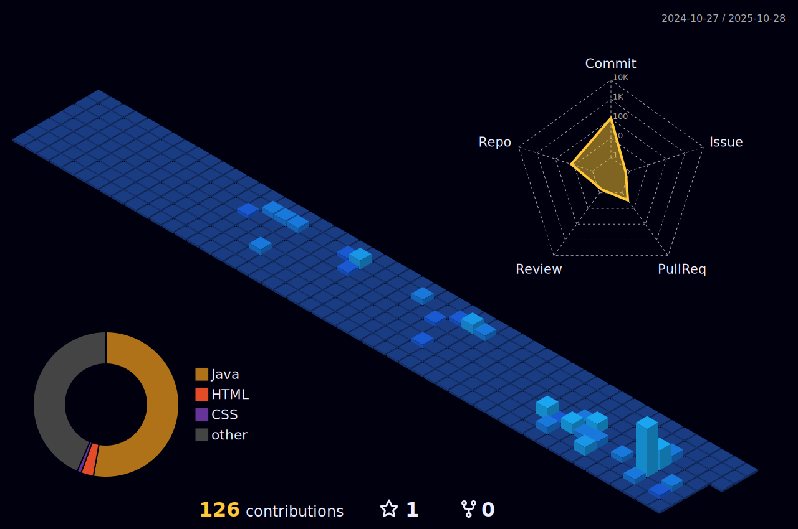

<h1 align="center">👋 Olá, eu sou a Diana Oliveira</h1>

💻 Estudante de Desenvolvimento de Sistemas 

---

## 📊 Contribuições em 3D

---

## 📊 Estatísticas

  
  
  
  
  

---

## 🚀 Tecnologias

  <!-- Java -->
  

    
    
Java

  

  <!-- HTML5 -->
  

    
    
HTML5

  

  <!-- CSS3 -->
  

    
    
CSS3

  

---
